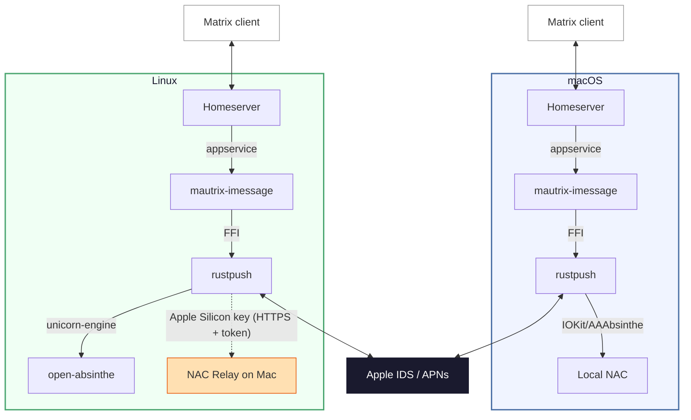

# Rustpush-Matrix

A Matrix-iMessage puppeting bridge. Send and receive iMessages from any Matrix client.

This is the **v2** rewrite using [rustpush](https://github.com/OpenBubbles/rustpush) and [bridgev2](https://mau.fi/blog/megabridge-twilio/) — it connects directly to Apple's iMessage servers without SIP bypass, Barcelona, or relay servers.

**Features**: text, images, video, audio, files, reactions/tapbacks, edits, unsends, typing indicators, read receipts, group chats, SMS forwarding, contact name resolution, **FaceTime calls** (web join links — works from non-Apple platforms), **iOS 18 Focus / Do Not Disturb status** for contacts, **iCloud Shared Albums**, and **Name & Photo Sharing** fallback for unknown senders.

**Platforms**: macOS (full features) and Linux (via hardware key extracted from a Mac once). Please note, Contact Key Verification must be disabled for the bridge to function.

## Quick Start (macOS)

macOS 13+ required (Ventura or later). Sign into iCloud on the Mac running the bridge (Settings → Apple ID) — this lets Apple recognize the device so login works without 2FA prompts.

### With Beeper

```bash
git clone https://github.com/lrhodin/imessage.git
cd imessage
make install-beeper
```

The installer handles everything: Homebrew, dependencies, building, Beeper login, iMessage login, config, and LaunchAgent setup.

### With a Self-Hosted Homeserver

```bash
git clone https://github.com/lrhodin/imessage.git
cd imessage
make install
```

The installer auto-installs Homebrew and dependencies if needed, walks you through homeserver URL / domain / Matrix ID / database choice and a few feature toggles (CloudKit backfill, FaceTime Bridge, StatusKit notifications, external CardDAV, HEIC conversion, video transcoding), generates config files, handles iMessage login, and starts the bridge as a LaunchAgent. It will pause and tell you exactly what to add to your `homeserver.yaml` to register the bridge. You can re-run `make install` any time to flip these toggles without wiping your data — see [Reconfiguring without editing YAML](#reconfiguring-without-editing-yaml).

## Quick Start (Linux)

The bridge runs on Linux using a hardware key extracted once from a real Mac. No Mac needed at runtime for Intel keys; **Apple Silicon Macs** require the NAC relay (a small background process on the Mac).

### Prerequisites

Ubuntu 22.04+ (or equivalent). Only `git`, `make`, and `sudo` are needed — the build installs everything else:

```bash
sudo apt install -y git make
```

### Step 1: Extract hardware key (one-time, on your Mac)

The path depends on your Mac's CPU. **Intel Macs** can hand off the key once and the Mac is no longer involved at runtime. **Apple Silicon Macs** (M1, M2, M3, …) lack the encrypted IOKit properties the x86_64 NAC emulator needs, so they additionally need a small NAC relay running on the Mac whenever the bridge is online.

#### Intel Mac

Pick one extraction option:

**Option A: GUI app (recommended, macOS 10.15+ Catalina)**

Build the SwiftUI extraction app on any Mac (Intel or Apple Silicon), then run it on the Intel Mac:

```bash
git clone https://github.com/lrhodin/imessage.git
cd imessage/tools/extract-key-app
./build.sh
# Copy ExtractKey.app to the Intel Mac and double-click it.
```

The app reads hardware identifiers, displays them, and lets you copy or save the base64 key. If the Mac is missing encrypted IOKit properties (`_enc` fields), the app offers an **Enrich Key** button to compute them on the spot — no extra steps needed.

> **Gatekeeper**: Because the app is ad-hoc signed (not notarized by Apple), macOS will block it on first launch. To open it:
>
> - **macOS 13+ (Ventura)**: Double-click the app. When the warning appears, go to **System Settings → Privacy & Security**, scroll down, and click **Open Anyway**.
> - **macOS 10.15–12**: Right-click (or Control-click) the app and choose **Open** from the context menu. Click **Open** in the dialog that appears.
> - **Terminal**: Run `xattr -cr ExtractKey.app` to strip the quarantine flag, then double-click normally.

**Option B: CLI (macOS 13+ with Go)**

```bash
git clone https://github.com/lrhodin/imessage.git
cd imessage
go run tools/extract-key/main.go
```

**Option C: older Macs (macOS 10.13 High Sierra through 12) without Go**

The CLI extractor uses CGO with macOS frameworks (Foundation, IOKit, DiskArbitration), so it has to be compiled on the target Mac itself. A self-contained build script handles that — it has its own `go.mod` pinned to Go 1.20 so it builds on High Sierra:

```bash
# On the older Mac:
git clone https://github.com/lrhodin/imessage.git
cd imessage/tools/extract-key
./build.sh
./extract-key
```

This reads hardware identifiers (serial, MLB, ROM, etc.) and outputs a base64 key. The Mac is not modified and can continue to be used normally.

**Enriching keys from older Macs**

Some older Intel Macs ship a stripped-down IOKit registry that's missing the encrypted hardware identifier fields (the `_enc` properties — five in total, covering serial, MLB, ROM, platform UUID, and root-disk UUID) the x86_64 NAC emulator needs. Extraction still completes, but Apple's IDS layer will later reject validation data computed from a key that lacks them. Enrichment encrypts the plaintext values with the same routine a real Mac uses, producing byte-identical `_enc` bytes.

**On the Mac (GUI app, single button press)**

The Option A app does this for you. If any `_enc` fields came back empty, an **Enrich Key** button appears next to the extracted key. Press it and the app fills in the missing fields and re-renders the now-complete base64 key for you to copy. The Mac running the app must be Intel.

**On the Linux bridge server (CLI, x86_64 only)**

If you extracted with the CLI (Option B / C) and the bridge fails NAC validation pointing at missing `_enc` fields, enrich on the Linux host instead:

```bash
cd rustpush/open-absinthe
cargo run --bin enrich_hw_key -- --file ~/hwkey.b64 > ~/hwkey-enriched.b64
```

Use the enriched output (`~/hwkey-enriched.b64`) for the rest of the install in place of the raw key. x86_64 Linux only.

#### Apple Silicon Mac

Run the NAC relay — a small HTTP server on the Mac that generates Apple validation data using the native `AAAbsintheContext` framework. The relay stays running whenever you want the bridge online; you'll point the bridge at it from the Linux side.

**Option 1: GUI app (recommended)**

Build and run the menubar app — it bundles the relay, key extraction, and status monitoring in one place:

```bash
cd tools/nac-relay-app
./build.sh
open NACRelay.app
```

The app appears as an antenna icon in the menubar (no dock icon). It auto-starts the relay on launch, shows the relay address and auth info, and lets you extract the hardware key with relay credentials embedded — all from the popover UI. Click **Extract Hardware Key**, then **Copy Key** to get the base64 key.

**Option 2: CLI**

```bash
go build -o ~/bin/nac-relay ./tools/nac-relay/
~/bin/nac-relay --setup
```

This installs a LaunchAgent that starts on login and auto-restarts if it crashes.

The relay auto-generates a self-signed TLS certificate and a random bearer token on first start, stored in `~/Library/Application Support/nac-relay/`. All endpoints (except `/health`) require the token. The bridge verifies the relay's certificate fingerprint (Go side) and authenticates with the token (both Go and Rust sides).

```bash
# Check it's running
tail -f /tmp/nac-relay.log
```

**Extract the key with the relay URL (CLI only — the GUI app does this automatically):**

```bash
go run tools/extract-key/main.go -relay https://<your-mac-ip>:5001/validation-data
```

The `extract-key` tool reads the token and certificate fingerprint from `relay-info.json` (written by the relay) and embeds them in the hardware key automatically. The relay must be running before you run `extract-key`.

If the bridge runs outside your LAN (e.g., cloud VM), forward port 5001 TCP to your Mac's local IP. Lock the allowed source IPs to your bridge server's IP for defense in depth — the relay is also protected by TLS + bearer token auth.

### Step 2: Build and install the bridge (on Linux)

#### With Beeper

```bash
git clone https://github.com/lrhodin/imessage.git
cd imessage
make install-beeper
```

#### With a Self-Hosted Homeserver

```bash
git clone https://github.com/lrhodin/imessage.git
cd imessage
make install
```

On first run expect ~3 minutes for the Rust library to compile.

### Step 3: Login

`make install` / `make install-beeper` detects that no login exists and runs the bridge's `login` subcommand inline at the end of Step 2. You're prompted right there in the terminal for:

1. Your hardware key (paste the base64 from Step 1)
2. Your Apple ID and password
3. The 2FA code sent to your trusted devices

When the script finishes you're already logged in and the bridge is up.

**Alternative: log in through the bridge bot.** If you ever need to log in (or log back in) outside the install script, DM the bridge bot in the Matrix management room and run the **"Apple ID (External Key)"** login flow there — same three prompts, same result.

## Login

There are two ways to log in:

- **Through the install script (default).** `make install` and `make install-beeper` detect a missing login and run `mautrix-imessage-v2 login` inline at the end of the install. This is the path almost everyone uses — answer the prompts in the terminal and you're done.
- **Through the bridge bot (alternative).** DM the bot in the Matrix management room and run the **"Apple ID (External Key)"** login flow. Useful if you skipped the script's login step, want to switch handles, or are re-logging without re-running install.

Either path follows the same prompts: Apple ID → password → 2FA (if needed) → handle selection. On macOS, if the Mac is signed into iCloud with the same Apple ID, login completes without 2FA.

If your Apple ID has multiple identities registered (e.g. a phone number and an email address), you'll be asked which one to use for outgoing messages. This is what recipients see your messages "from". To change it later, set `preferred_handle` in the config (see [Configuration](#configuration)) or log in again.

### SMS Forwarding

To bridge SMS (green bubble) messages, enable forwarding on your iPhone:

**Settings → Messages → Text Message Forwarding** → toggle on the bridge device.

### Receiving messages

Incoming iMessages automatically create Matrix rooms. History backfill uses **CloudKit** by default — that's the modern, supported path and what almost everyone should pick.

**Local chat.db** (`backfill_source: chatdb`) is a last-resort fallback for older macOS versions that can't run CloudKit backfill at all. If your Mac is in that bucket, the **preferred workaround is to run the bridge on Linux instead** (extract the hardware key once via [Quick Start (Linux)](#quick-start-linux), then let the Linux bridge do CloudKit backfill normally). Only choose `chatdb` if you actually have to run the bridge on a legacy Mac and Linux isn't an option — it's macOS-only and requires **Full Disk Access** (System Settings → Privacy & Security → Full Disk Access → add the bridge binary or Terminal) to read `~/Library/Messages/chat.db`. Without FDA the bridge can't read the file and chat.db backfill silently does nothing.

## Bridge commands

In the **management room** (the bot DM, opened automatically when you log in), type commands bare — no prefix:

```
start-chat
help
logout
```

In **portal rooms** (any bridged DM or group), prefix commands with `!im`:

```
!im facetime
!im help
```

To abort an interactive command (a picker waiting for your reply), type `cancel` in the management room or `!im cancel` in a portal.

### Common commands

| Command | What it does |
|---|---|
| `start-chat` | Open a new iMessage DM. With no arguments, the bot walks you through phone vs. email and explains the country-code format. With an argument (`start-chat +15551234567` or `start-chat someone@icloud.com`) it skips the picker. |
| `contacts` | Search your synced contacts by name (iCloud, external CardDAV, or local macOS Contacts depending on `backfill_source` and `carddav` settings) and reply with a number to open a chat. Different from `start-chat` — use this when you don't remember the number/email. Alias: `find`. |
| `restore-chat` | List iMessage chats in the recycle bin. Reply with a number to bring one back, including its history. |
| `logout` | Sign out of iMessage. Lists active handles, you reply with a number (or `all`). The bot then walks you through the manual step at `appleid.apple.com → Devices` to fully revoke the bridge from Apple's servers. |
| `help` | Full command list, grouped by section. |

### Phone-number format for `start-chat`

Always include the country code with a leading `+`. Spaces, dashes, and parentheses are stripped automatically; you don't need to type `tel:` / `mailto:` prefixes either.

| Country | Format |
|---|---|
| USA / Canada | `+1 555 123 4567` |
| UK | `+44 20 7946 0958` |
| France | `+33 1 23 45 67 89` |
| India | `+91 98765 43210` |

A bare US number (`5551234567`) won't work — the country code is required. Look up codes at <https://countrycode.org>.

### Logging out

`logout` does the bridge-side teardown automatically — disconnects from Apple, removes the login from the bridge, kicks you from portals, and wipes the local session backup so a re-login starts from a clean slate.

The bridge has no API to deregister your IDS identity from Apple, so the success message walks you through the final step:

1. Sign in at <https://appleid.apple.com>.
2. Go to **Devices**.
3. Find the entry for the bridge (often shown as a Mac, sometimes named "Apple Device").
4. Click **Remove from account**.

Until you do step 4, Apple still considers the bridge a registered iMessage device.

## FaceTime

> **Who this is for**: Matrix users on **Android, Windows, and Linux** who don't have an Apple device to take FaceTime calls on. The bridge places and receives FaceTime calls through Apple's web client (which runs in any modern browser on those platforms). If you already own a Mac or iPhone signed into the same Apple ID, the call rings on your Apple device natively and the bridge's web-join wrapper just clutters the chat — see [Opting out](#opting-out) below.

### In a 1:1 portal

```
!im facetime
```

Rings the contact and posts a "🌐 Join FaceTime call" notice in the portal. Tap the link on your Android / Windows / Linux Matrix client to open Apple's FaceTime web client in a browser and join the call. The contact's iPhone or Mac shows it as a normal incoming FaceTime, and they can answer wherever they like.

When a contact rings **you**, the bridge posts "📞 **Incoming FaceTime call from {name}.**" in the DM portal with an **Answer FaceTime call** link that opens the FaceTime web client in your browser. Missed calls show up as a notice with a **Call back {name}** button (taps re-ring the contact through the bridge); "answered on another device" surfaces as a one-line passive notice. The bridge keeps a persistent ghost in the room used for FaceTime signalling — that's expected, leave it in place.

### Other commands

| Command | What it does |
|---------|-------------|
| `facetime-send` | Generate a link and deliver it as an iMessage to the contact (no Matrix message). |
| `facetime-clear` | Revoke every bridge-created FaceTime link so the next `facetime` mints a fresh one. |
| `facetime-invalidate-peer` | Force the peer's device to drop its cached bridge identity. Use when calls intermittently come through as audio-only. |
| `facetime-rotate-identity` | Re-register the bridge's IDS identity (heavier than the per-peer invalidate). |
| `facetime-letmein` / `facetime-letmein-approve` / `facetime-letmein-deny` | List, approve, or deny pending Let-Me-In delegated-access requests. |

A full list lives under `!im help` in the **FaceTime** section.

### Display name on join links

The name pre-filled on the FaceTime web join page comes from your Apple Account. To override it, set `facetime_display_name` in `~/.local/share/mautrix-imessage/config.yaml`.

### Opting out

If you have a Mac or iPhone signed into the same Apple ID, FaceTime rings there natively — the bridge's web-join wrapper adds nothing, so you should disable it. The `make install` / `make install-beeper` scripts ask "Disable FaceTime Bridge?" both on first install and on every subsequent re-run, so you can flip this at any time without editing YAML by hand. (You can also set `disable_facetime: true` in `~/.local/share/mautrix-imessage/config.yaml` directly.) Disabling skips every `facetime-*` command and suppresses all inbound FaceTime notices in your Matrix portals.

## Focus & Do Not Disturb

When a contact toggles a Focus mode (Do Not Disturb, Sleep, Work, etc.) on iOS 18+, the bridge surfaces it inline in the relevant DM portal:

- A quiet `m.notice` ("🔕 Name has notifications silenced (Do Not Disturb).") posts when DND turns on, and clears when it turns off.
- The contact's Matrix ghost gets a presence update so clients that show presence reflect the same state.

This is the same affordance Apple's Messages app shows in-conversation. The bridge announces itself as "available" once after startup so peer iPhones reciprocate with the key material needed to decrypt their subsequent presence updates — leave `statuskit_share_on_startup: true` for the best chance of seeing contacts' Focus state.

If you find the notices noisy or already see Focus state on another Apple device, the install scripts ask "Enable StatusKit notifications?" on first install and on every subsequent re-run, so you can flip it at any time. (Or set `statuskit_notifications: false` in `~/.local/share/mautrix-imessage/config.yaml`.) Disabling suppresses the user-visible notices and presence updates while keeping the underlying StatusKit registration intact.

## Shared Albums

iCloud Shared Albums (Photo Streams) you subscribe to surface as dedicated rooms with the album's photos and videos backfilled. Use:

| Command | What it does |
|---------|-------------|
| `shared-albums` | Browse available Shared Albums; pick one, then pick assets to download. |
| `shared-subscribe <album-id>` | Subscribe to a Shared Album by ID so the bridge watches it for new assets. |
| `shared-subscribe-token <token>` | Subscribe via the one-time invitation token from an iCloud share URL (`icloud.com/sharedalbum/...`). |
| `shared-unsubscribe <album-id>` | Unsubscribe from an album so the bridge stops watching it. |
| `shared-state` | Dump current Shared Streams state as JSON (debugging). |

A full list lives under `!im help` in the **Shared Streams** section.

## Image and video conversion

The bridge converts a handful of formats automatically so attachments render in Matrix clients and reach iMessage in formats Apple's clients accept. Two behaviours are gated on opt-in toggles; the rest run unconditionally.

### Always on, both directions

- **TIFF ↔ JPEG.** TIFF is re-encoded to JPEG at quality 95 in either direction.
- **Opus voice notes.** iMessage uses Opus in Apple's CAF container; Matrix clients use Opus in an OGG container. The bridge remuxes between the two (no re-encoding — same codec, different wrapper) in either direction.

### Always on, outgoing only

- **Other non-JPEG images → JPEG** at quality 95. PNG and similar formats sent from Matrix are re-encoded before being handed to iMessage; the Matrix event is also edited in place so other Matrix clients see the corrected file. Incoming PNG passes through unchanged.

### Opt-in, incoming only

- **HEIC / HEIF → JPEG** — gated on `heic_conversion` (default off). Decoded with `libheif`, re-encoded at `heic_jpeg_quality` (default `95`, clamped to 1–100). EXIF, ICC color profile, and XMP are preserved; orientation is normalised because `libheif` applies the rotation during decode. Animated / multi-image HEICs collapse to the primary frame with a warning. With the toggle off, HEIC bytes pass through to Matrix — modern clients (Element, Beeper) render them, older clients may not.
- **Non-MP4 video → MP4** — gated on `video_transcoding` (default off). Applies to any `video/*` MIME that isn't already `video/mp4` (`.mov`, `.m4v`, MKV, AVI, WebM, …). The bridge tries a stream-copy remux first (`ffmpeg -c copy -movflags +faststart`) — fast and lossless. If that fails, it falls back to a full re-encode (H.264 `-preset fast -crf 23` plus AAC). Audio tracks are preserved in both modes. The Matrix event ends up as `.mp4` / `video/mp4`.

### Live Photos

iMessage Live Photos arrive as a HEIC still + MOV pair. The still goes through HEIC conversion if `heic_conversion` is on; the MOV goes through video transcoding if `video_transcoding` is on. Both pieces are delivered to Matrix as adjacent messages.

### Dependencies

- **`libheif`** is a build dependency. `make build` installs it via Homebrew (macOS) or `apt`/`dnf`/`pacman`/`zypper`/`apk` (Linux) before compiling, regardless of whether `heic_conversion` is enabled.
- **`ffmpeg`** is required at runtime only when `video_transcoding` is enabled. The install scripts install it via the same package manager when you turn the toggle on during the interactive prompts.

## How It Works

The bridge connects directly to Apple's iMessage servers using [rustpush](https://github.com/OpenBubbles/rustpush) with local NAC validation (no SIP bypass, no relay server). When `backfill_source: chatdb` is set on macOS, it additionally reads `~/Library/Messages/chat.db` for backfill and uses the local Contacts framework for name resolution; the default CloudKit path uses iCloud for both.

On Linux, NAC validation uses one of two paths:

- **Intel key**: [open-absinthe](rustpush/open-absinthe/) emulates Apple's `IMDAppleServices` x86_64 binary via unicorn-engine, hooking IOKit/CoreFoundation calls and feeding them hardware data from the extracted key
- **Apple Silicon key + relay**: The bridge fetches validation data from a NAC relay running on the Mac, which calls Apple's native `AAAbsintheContext` framework



### Real-time and backfill

**Real-time messages** flow through Apple's push notification service (APNs) via rustpush and appear in Matrix immediately.

**CloudKit backfill** (optional, off by default) syncs your iMessage history from iCloud on first login. Enable it during `make install` or by setting `cloudkit_backfill: true` in config. When enabled, the login flow will ask for your device PIN to join the iCloud Keychain trust circle, which grants access to Messages in iCloud.

On the **first** install (before the bridge database exists), the install script asks whether you want to cap messages per chat:

- Answer **no** and every available message is backfilled.
- Answer **yes** and pick a per-chat limit (minimum 100).

The cap can't be changed on later re-runs once the database is in place — edit `~/.local/share/mautrix-imessage/config.yaml` directly to change it.

## Management

### Shell shortcuts

At the end of every install run, the installer offers to drop four aliases into your `~/.zshrc` or `~/.bashrc` so you don't have to memorize the platform-specific `launchctl` / `systemctl` incantations:

| Alias | What it does |
|---|---|
| `start-imessage` | Start the bridge |
| `stop-imessage` | Stop the bridge |
| `restart-imessage` | Restart the bridge |
| `imessage-log` | Tail the live bridge log |

The prompt defaults to **no** — answer `y` to install. The aliases are wrapped in a marker comment block (`# >>> mautrix-imessage shortcuts (managed) >>>` … `# <<< mautrix-imessage shortcuts (managed) <<<`), so re-running an installer and answering `y` replaces (rather than duplicates) the entries. If you skipped them on first install, just re-run and say `y`. To remove them later, delete the marker block from your `~/.zshrc` or `~/.bashrc` by hand — the installer doesn't have an "uninstall aliases" path. Bash and Zsh are auto-detected from `$SHELL`; other shells get a clean skip message. After install, open a new terminal — or `source ~/.zshrc` (or `~/.bashrc`) in your current one — to pick the aliases up.

The raw equivalents (and other knobs) are below if you'd rather wire your own thing.

### macOS

```bash
# View logs
tail -f ~/.local/share/mautrix-imessage/bridge.stdout.log

# Restart (auto-restarts via KeepAlive)
launchctl kickstart -k gui/$(id -u)/com.lrhodin.mautrix-imessage

# Stop until next login
launchctl bootout gui/$(id -u)/com.lrhodin.mautrix-imessage

# Uninstall
make uninstall
```

### Linux

```bash
# If using systemd (from make install / make install-beeper)
systemctl --user status mautrix-imessage
journalctl --user -u mautrix-imessage -f
systemctl --user restart mautrix-imessage

# If running directly (debugging or non-systemd hosts)
./mautrix-imessage-v2 -c ~/.local/share/mautrix-imessage/config.yaml
```

### NAC Relay (macOS)

These commands apply to the **CLI install** (LaunchAgent at `com.imessage.nac-relay`). The GUI menubar app manages itself — launch/quit it via the menubar antenna icon, and use the popover for status. The GUI app does not write `/tmp/nac-relay.log`.

```bash
# View logs (CLI install only)
tail -f /tmp/nac-relay.log

# Restart
launchctl kickstart -k gui/$(id -u)/com.imessage.nac-relay

# Stop
launchctl bootout gui/$(id -u)/com.imessage.nac-relay
```

## Configuration

Config lives in `~/.local/share/mautrix-imessage/config.yaml` (generated during install). The default path is set by the Makefile's `DATA_DIR` variable; override it on the command line if you want a different location (e.g. `make install DATA_DIR=/srv/imessage`).

### Reconfiguring without editing YAML

The install scripts (`make install` and `make install-beeper`) are idempotent — re-run them any time and they detect the existing config, then walk you through interactive prompts to flip individual settings. Nothing is wiped. You can use a re-run to change:

- **Preferred handle** — pick a different `tel:` / `mailto:` from the registered list
- **External CardDAV** — change email / server / app password
- **CloudKit backfill** — enable or disable, switch between CloudKit and `chat.db` sources
- **FaceTime Bridge** — enable or disable (`disable_facetime`)
- **StatusKit notifications** — enable or disable iOS 18 Focus / DND notices (`statuskit_notifications`)
- **HEIC conversion / video transcoding** — toggle on or off
- **Shell shortcuts** — add the `start-imessage` / `stop-imessage` / `restart-imessage` / `imessage-log` aliases on the next re-run if you skipped them initially (see [Shell shortcuts](#shell-shortcuts))

```bash
make install              # self-hosted homeserver
make install-beeper       # Beeper
```

The per-chat backfill cap (`backfill.max_initial_messages`) is asked only on the **first** install, before the bridge database exists. To change it later, edit `~/.local/share/mautrix-imessage/config.yaml` directly.

> **Warning:** the next snippet deletes your bridge state. Only run it if you mean to start over.

To start completely from scratch (new homeserver, new login, blank database), tear down both LaunchAgents and the on-disk state, then re-run:

```bash
# Bridge
launchctl bootout gui/$(id -u)/com.lrhodin.mautrix-imessage 2>/dev/null
rm -f ~/Library/LaunchAgents/com.lrhodin.mautrix-imessage.plist
rm -rf ~/.local/share/mautrix-imessage

# NAC relay (Apple Silicon Mac users only)
launchctl bootout gui/$(id -u)/com.imessage.nac-relay 2>/dev/null
rm -f ~/Library/LaunchAgents/com.imessage.nac-relay.plist
rm -rf ~/Library/Application\ Support/nac-relay ~/Applications/nac-relay.app

make install
```

### Key options

Most knobs live at the top level of the network connector config. Defaults shown match `pkg/connector/example-config.yaml`.

| Field | Default | What it does |
|-------|---------|-------------|
| `cloudkit_backfill` | `false` | Master switch for message history backfill. Requires device PIN during login to join the iCloud Keychain. |
| `backfill_source` | `cloudkit` | `cloudkit` (default) or `chatdb` (legacy macOS fallback only — macOS-only, requires Full Disk Access). For legacy Macs prefer running the bridge on Linux with CloudKit instead. Only relevant when `cloudkit_backfill` is true. |
| `displayname_template` | *(see [example-config.yaml](pkg/connector/example-config.yaml))* | Go template controlling how iMessage contacts appear in Matrix. Falls through `FirstName → LastName → Nickname → Phone → Email → ID`. Variables: `{{.FirstName}}`, `{{.LastName}}`, `{{.Nickname}}`, `{{.Phone}}`, `{{.Email}}`, `{{.ID}}`. |
| `preferred_handle` | *(from login)* | Outgoing iMessage identity in URI form (`tel:+15551234567` or `mailto:user@example.com`). |
| `disable_facetime` | `false` | Skip every `facetime-*` command and suppress inbound FaceTime notices. Set true if you have a Mac/iPhone that handles FT natively. |
| `facetime_display_name` | *(from Apple Account SPD)* | Override the name pre-filled on FaceTime web join links. Falls back to the bare iMessage handle if the SPD lookup is also blank. |
| `statuskit_share_on_startup` | `true` | Publish "available" once after startup so peer iPhones reciprocate with the key material needed to decrypt their Focus/DND state. |
| `statuskit_notifications` | `true` | Post inline `m.notice` + ghost presence updates when contacts toggle iOS 18 Focus / DND. The underlying StatusKit registration runs either way. |
| `video_transcoding` | `false` | Auto-remux non-MP4 videos (e.g. QuickTime `.mov`) to MP4 for broad Matrix client compatibility. Requires `ffmpeg`. |
| `heic_conversion` | `false` | Auto-convert HEIC/HEIF images to JPEG. Requires `libheif`. |
| `heic_jpeg_quality` | `95` | JPEG output quality (1–100) when HEIC conversion is enabled. |
| `carddav.email` / `carddav.url` / `carddav.username` / `carddav.password_encrypted` | *(unset)* | External CardDAV server for contact name resolution (Google with app passwords, Nextcloud, Radicale, Fastmail, etc.). Set up via the install script's CardDAV prompt or the `mautrix-imessage-v2 carddav-setup` subcommand. When configured, used instead of iCloud contacts. |
| `backfill.max_initial_messages` | `2147483647` | Cap on messages per chat for the initial backfill (`2147483647` = uncapped). The install script writes this when CloudKit backfill is enabled — uncapped by default, or the per-chat limit (≥100) you pick on first install. |
| `encryption.allow` | `false` | bridgev2 framework option. Set `true` to enable end-to-bridge encryption. |
| `database.type` | `postgres` | bridgev2 framework option. `postgres` or `sqlite3-fk-wal`; the install script asks during first run and defaults to `postgres`. |

## Development

```bash
make build      # Build .app bundle (macOS) or binary (Linux)
make rust       # Build Rust library only
make bindings   # Regenerate Go FFI bindings (needs uniffi-bindgen-go)
make clean      # Remove build artifacts
```

### Source layout

```
cmd/mautrix-imessage/        # Entrypoint + carddav-setup subcommand
pkg/connector/               # bridgev2 connector
  ├── connector.go           #   bridge lifecycle + platform detection
  ├── client.go              #   send/receive/reactions/edits/typing
  ├── login.go               #   Apple ID + external key login flows
  ├── commands.go            #   start-chat, logout, restore-chat, msg-debug, …
  ├── facetime.go            #   FaceTime web-join + call control
  ├── statuskit_commands.go  #   StatusKit (Focus / DND) commands
  ├── sharedstreams.go       #   iCloud Shared Albums commands + sync
  ├── shared_profile.go      #   Name & Photo Sharing fallback
  ├── external_carddav.go    #   External CardDAV contact resolution
  ├── carddav_crypto.go      #   App-password encryption for carddav config
  ├── heic.go                #   HEIC → JPEG conversion
  ├── audioconvert.go        #   Audio remux to M4A/CAF
  ├── chatdb.go              #   chat.db backfill + contacts (macOS)
  ├── ids.go                 #   identifier/portal ID conversion
  ├── capabilities.go        #   supported features
  └── config.go              #   bridge config schema
pkg/rustpushgo/              # Rust FFI wrapper (uniffi)
rustpush/
  └── open-absinthe/         # NAC emulator overlay (unicorn-engine, in-tree)
      └── src/bin/enrich_hw_key  # Enrich Intel keys missing _enc fields (x86_64 Linux CLI)
third_party/
  └── rustpush-upstream.sha  # Pinned OpenBubbles/rustpush SHA; Makefile clones + overlays open-absinthe
nac-validation/              # Local NAC via AppleAccount.framework (macOS)
tools/
  ├── extract-key/           # Hardware key extraction CLI for Intel Macs (Go)
  ├── extract-key-app/       # Hardware key extraction GUI for Intel Macs (SwiftUI)
  ├── nac-relay/             # NAC validation relay CLI for Apple Silicon Macs (Go)
  └── nac-relay-app/         # NAC relay menubar app for Apple Silicon Macs (SwiftUI)
imessage/                    # macOS chat.db + Contacts reader
```

## Chat With Us

**Chat with us on Matrix**: [Join our Room Here](https://matrix.to/#/#imessage-rustpush:beeper.com)

## License

AGPL-3.0 — see [LICENSE](LICENSE).
